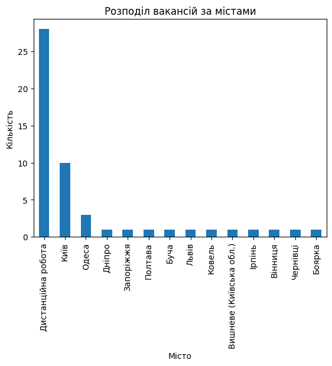
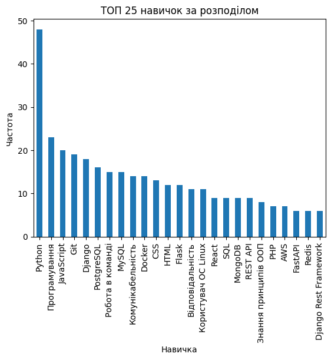

# Scraping and Analysis of Job Vacancies 🌐

Welcome to the scraping and analysis project for job vacancies dataset from Work.ua!

## Project Overview📖

This project aims to collect data on Python-related job vacancies from Work.ua, perform scraping using Scrapy, and
conduct analysis on the collected dataset. The project aims to provide insights into the demand for Python skills in the
job market, the geographical distribution of job opportunities, and the required skills for Python-related positions.

## Project Components🚀

### Scraping Script 📜:

The project's main component is a Scrapy spider (WorkUASpider) designed to scrape Python-related job vacancies from the
Work.ua website. The spider navigates through multiple job listing pages, extracting job titles, cities, and required
skills for each vacancy.

### Data Analysis 🧑🏻‍💻:

After scraping the data, analysis is performed using Jupyter Notebook. The notebook includes various analyses such as:

- Distribution of job vacancies by city
- Most in-demand skills for Python-related positions
- Visualization of key insights using Python libraries like Matplotlib

## Examples 🌐:

# How to install 🆕:

## Using GitHub

Ensure you have Python 3 installed.

Clone the repository:

    https://github.com/goldenuni/scraping-analysis-vacancy.git
    cd scraping-analysis-vacancy

# How to Run ▶️

1. Create a virtual environment: `python -m venv venv`
2. Activate the virtual environment:

    * On Windows: `venv\Scripts\activate`

    * On macOS and Linux: `source venv/bin/activate`
3. Install dependencies:
   pip install -r requirements.txt
4. Run the Scrapy spider to scrape data: `scrapy crawl work_ua -O vacancy.csv`
5. Run the Jupyter Notebook: `jupyter notebook`
6. Open the notebook (analysis.ipynb) and execute the cells to perform data analysis.
